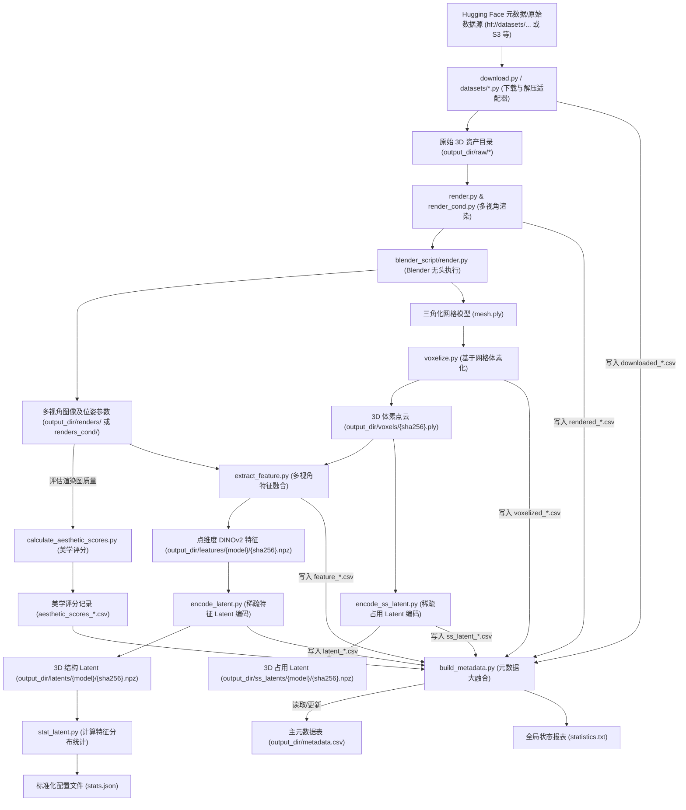

# TRELLIS Dataset Toolkits 核心架构与数据流向指南

本篇文档对 `dataset_toolkits` 目录下的项目代码结构、各模块文件的执行功能以及数据的全链路流向进行系统性梳理，用以指导数据集构建、增量更新和后续的 3D 生成模型训练。

---

## 1. 项目目录结构梳理

`dataset_toolkits` 是 TRELLIS 数据预处理与特征提取的核心工具集，主要支持对 Toys4k、ObjaverseXL、3D-FUTURE、ABO 和 HSSD 等多种学术界与开源 3D 数据集的下载、渲染、体素化、特征投影和 Latent 空间编码。

目录拓扑结构如下所示：

```text
dataset_toolkits/
├── datasets/                            # 数据集专用下载与迭代适配层
│   ├── 3D-FUTURE.py                     # 3D-FUTURE 数据集提取与下载适配器
│   ├── ABO.py                           # Amazon Berkeley Objects (ABO) 适配器
│   ├── HSSD.py                          # Habitat Synthetic Scene Dataset (HSSD) 适配器
│   ├── ObjaverseXL.py                   # Objaverse-XL 数据集下载与分包处理适配器
│   └── Toys4k.py                        # Toys4k 数据集本地提取与适配器
├── blender_script/                      # Blender 无头运行脚本与三方插件
│   ├── io_scene_usdz.zip                # 用于导入 USDZ 格式的 Blender 插件包
│   └── render.py                        # Blender 内部执行的场景渲染与网格导出核心逻辑
├── download.py                          # 多进程分布式下载调度入口
├── build_metadata.py                    # 数据集元数据构建、多节点 CSV 合并与物理文件扫描工具
├── render.py                            # 宏观多视角渲染调度入口（调用 Blender）
├── render_cond.py                       # 宏观高分辨率条件图像渲染调度入口（自适应 FOV 和 Radius）
├── voxelize.py                          # 基于 Open3D 的 3D 网格体素化点云生成器
├── calculate_aesthetic_scores.py        # 基于 OpenCLIP 与 LAION 线性预测器的渲染美学评估
├── extract_feature.py                   # 多视角图像 DINOv2 特征反投影融合提取器
├── encode_latent.py                     # 3D 稀疏点特征 Latent 编码器（SLat Encoder）
├── encode_ss_latent.py                  # 3D 稀疏几何占用二值 Latent 编码器（SS Encoder）
├── stat_latent.py                       # 编码后 Latent 值的信道均值/方差统计工具（用于 Diffusion 正则化）
├── utils.py                             # 基础实用函数工具（低偏差序列球面采样、SHA256 哈希计算等）
└── setup.sh                             # 依赖环境一键安装脚本
```

---

## 2. 代码文件功能详解

### 2.1 基础与工具层
*   **[setup.sh](file:///Users/lym/Documents/Antigravity/TRELLIS/dataset_toolkits/setup.sh)**
    *   **功能**：一键安装此工具包依赖的 Python 库，包括 `open3d`、`objaverse`、`open_clip_torch`、`easydict` 等。
*   **[utils.py](file:///Users/lym/Documents/Antigravity/TRELLIS/dataset_toolkits/utils.py)**
    *   **功能**：
        *   `get_file_hash`：通过流式读取计算文件的 SHA-256 唯一标识哈希值。
        *   `sphere_hammersley_sequence`：基于 Hammersley/Halton 低偏差准随机序列生成在球面均匀分布的相机采样点坐标（yaw, pitch, radius）。

### 2.2 数据集适配层 (`datasets/`)
各个适配器主要提供以下统一的接口契约（由主调度脚本反射或静态调用）：
*   `get_metadata(**kwargs)`：从 Hugging Face 存储库加载对应的 CSV 基础元数据表。
*   `download(metadata, output_dir, **kwargs)`：负责实现原始 3D 资产包的获取和解压（例如，Toys4k 需要本地 ZIP 提取、ABO 从 Amazon 官方 S3 下载、ObjaverseXL 使用 `objaverse.xl` 接口），校验 SHA-256，返回记录 `['sha256', 'local_path']` 的 DataFrame。
*   `foreach_instance(metadata, output_dir, func, max_workers, desc)`：封装多线程分发逻辑，针对各个原始文件进行并发函数回调，自动处理部分数据集存在的特殊归档格式（如 ObjaverseXL 中从多层级 zip 中读取模型）。

具体适配器：
*   **[Toys4k.py](file:///Users/lym/Documents/Antigravity/TRELLIS/dataset_toolkits/datasets/Toys4k.py)**：手动下载 `toys4k_blend_files.zip` 后进行解压提取与 SHA-256 校验。
*   **[ObjaverseXL.py](file:///Users/lym/Documents/Antigravity/TRELLIS/dataset_toolkits/datasets/ObjaverseXL.py)**：利用 `objaverse.xl` 的 API 增量下载 Sketchfab 或 GitHub 的 3D 模型包并解包。
*   **[3D-FUTURE.py](file:///Users/lym/Documents/Antigravity/TRELLIS/dataset_toolkits/datasets/3D-FUTURE.py)**：解压物理 `3D-FUTURE-model.zip`，提取 OBJ 格式网格并用对应 `image.jpg` 进行哈希一致性检验。
*   **[ABO.py](file:///Users/lym/Documents/Antigravity/TRELLIS/dataset_toolkits/datasets/ABO.py)**：自动从 S3 下载 `abo-3dmodels.tar` 并解包为 glTF 格式模型。
*   **[HSSD.py](file:///Users/lym/Documents/Antigravity/TRELLIS/dataset_toolkits/datasets/HSSD.py)**：通过 Hugging Face Hub 下载并校对 `hssd-models` 原始模型资产。

### 2.3 下载与元数据整合层
*   **[download.py](file:///Users/lym/Documents/Antigravity/TRELLIS/dataset_toolkits/download.py)**
    *   **功能**：多进程分布式下载原始资产的控制器。根据数据集命令行参数动态导入适配模块，读取全局 `metadata.csv`。根据 `--rank` 与 `--world_size` 将任务分割给多台机器并行下载，保存当前节点的下载记录为 `downloaded_{rank}.csv`。
*   **[build_metadata.py](file:///Users/lym/Documents/Antigravity/TRELLIS/dataset_toolkits/build_metadata.py)**
    *   **功能**：数据集元数据总控台。
        *   **增量更新与合并**：收集所有节点生成的临时 CSV 文件（`downloaded_*.csv`、`rendered_*.csv`、`voxelized_*.csv` 等），更新回主 `metadata.csv`。
        *   **物理恢复**：如果开启 `--from_file`，通过多线程扫描物理路径（检查 `renders/` 目录下 `transforms.json` 是否存在，`voxels/` 目录下 `.ply` 体素是否存在，以及特征和 latent 文件是否生成），强行修复并对齐 CSV 中的状态标记。
        *   **统计输出**：生成当前数据集资产的各项处理比例报告，输出至 `statistics.txt`。

### 2.4 可视化渲染与体素化层
*   **[render.py](file:///Users/lym/Documents/Antigravity/TRELLIS/dataset_toolkits/render.py)**
    *   **功能**：宏观多视角渲染调度器。自动在本地或无头主机 `/tmp` 下安装 Blender 3.0.1。使用 Hammersley 球面序列在目标模型周围采样 150 个视角的相机参数。以 subprocess 启动 Blender 并运行 `blender_script/render.py` 对模型进行渲染。输出 `rendered_{rank}.csv`。
*   **[render_cond.py](file:///Users/lym/Documents/Antigravity/TRELLIS/dataset_toolkits/render_cond.py)**
    *   **功能**：条件视角（Cond View）渲染调度器。为后续 Image-to-3D 提取条件图做准备。在 10° 到 70° 之间随机采样 FOV，并基于 `r = sqrt(3) / (2 * sin(fov/2))` 动态调整相机距离 `r`，确保物体（外接球半径为 `sqrt(3)/2`）恰好充满高分辨率（1024x1024）渲染视口。
*   **[blender_script/render.py](file:///Users/lym/Documents/Antigravity/TRELLIS/dataset_toolkits/blender_script/render.py)**
    *   **功能**：Blender 内部执行的渲染工作流核心。
        *   支持绝大多数常见 3D 资产格式（gltf, obj, fbx, stl, usdz 等）的自动导入。
        *   **场景归一化（Normalize）**：计算模型包围盒，自适应缩放并将其中心点平移至世界坐标系原点。
        *   **多视角自动渲染**：操纵相机绕物运行，保存多视角彩色图像（512x512 或 1024x1024）。在 Compositor 中配置节点保存 Depth 图、Normal 图、Albedo 图和 Mist 图。
        *   **相机参数导出**：在 `transforms.json` 中保存外参矩阵（`transform_matrix`）、内参（`camera_angle_x` 即 FOV）、以及场景缩放与位移量。
        *   **网格三角化（Triangulate）与保存**：如果启用 `--save_mesh`，会自动将场景中所有的材质对象折叠为 Mesh，强制进行三角面重构，并导出为标准的 `mesh.ply`，以供下一步体素化使用。
*   **[voxelize.py](file:///Users/lym/Documents/Antigravity/TRELLIS/dataset_toolkits/voxelize.py)**
    *   **功能**：输入 `mesh.ply`，使用 Open3D 的 `VoxelGrid` 机制，在指定的 `64x64x64` 三维包围盒中进行体素占用分析。提取已占用体素的离散索引点，归一化到 `[-0.5, 0.5]` 的物理坐标系中，输出为 `voxels/{sha256}.ply` 的点云文件。

### 2.5 评估与多模态特征/潜空间编码层
*   **[calculate_aesthetic_scores.py](file:///Users/lym/Documents/Antigravity/TRELLIS/dataset_toolkits/calculate_aesthetic_scores.py)**
    *   **功能**：美学评分过滤。加载 OpenCLIP 与训练好的 LAION 美学预测头部，多线程批量读取模型的局部截图（Snapshots），计算美学均值、方差等指标并落盘。这有助于过滤低质量、破损、畸形或纹理极差的 3D 资产。
*   **[extract_feature.py](file:///Users/lym/Documents/Antigravity/TRELLIS/dataset_toolkits/extract_feature.py)**
    *   **功能**：多视角特征反投影融合。
        1. 载入 3D 物理体素点坐标（`voxels/{sha256}.ply`）与渲染生成的多视角彩色图。
        2. 将彩色图批处理送入 DINOv2 图像骨干网络（提取密集局部 patch tokens）。
        3. 利用相机内参外参矩阵，将 3D 中的体素物理点投影到所有相机的 2D 图像平面上。
        4. 通过 `F.grid_sample` 在 2D DINOv2 特征图上双线性插值采样出体素的投影特征。
        5. 将体素在各个视角下的特征进行均值汇聚，以此将 2D 语义先验深度赋予 3D 体素。最终将带索引的 1024 维特征压缩保存为 `features/{model}/{sha256}.npz`。
*   **[encode_latent.py](file:///Users/lym/Documents/Antigravity/TRELLIS/dataset_toolkits/encode_latent.py)**
    *   **功能**：3D 结构 Latent 提取。加载提取的体素索引及融合特征 NPZ，将其打包为 `SparseTensor`，通过 TRELLIS 的 3D 稀疏 Swin-Transformer 结构编码器（SLat Encoder）进行特征变换与降维，提取在稀疏 3D 结构表征下的紧凑 Latent 特征，保存为 `latents/{latent_name}/{sha256}.npz`。
*   **[encode_ss_latent.py](file:///Users/lym/Documents/Antigravity/TRELLIS/dataset_toolkits/encode_ss_latent.py)**
    *   **功能**：3D 占用 Latent 提取。将 `voxels/{sha256}.ply` 的坐标复原为 `64x64x64` 的三维二值网格（1 表示占用，0 表示空闲），然后输入 3D 卷积神经网络编码器（SS Encoder），提取表征纯 3D 占用形态的 Latent 均值参数，保存为 `ss_latents/{latent_name}/{sha256}.npz`。
*   **[stat_latent.py](file:///Users/lym/Documents/Antigravity/TRELLIS/dataset_toolkits/stat_latent.py)**
    *   **功能**：批量采样并计算所提取 3D 结构 Latent 特征在信道（Channels）维度的均值 `mean` 和标准差 `std`，将结果写入 `stats.json`。该参数将被后端 Diffusion 训练用作标准归一化标尺。

---

## 3. 数据流向与依赖关系说明

在构建 TRELLIS 训练数据集时，数据会在各个工具模块间进行层层流转，前一步的输出作为后一步的输入。

### 3.1 核心数据流拓扑图



### 3.2 详细流转步骤描述

1.  **数据初始化 (Data Ingestion)**
    *   **输入**：Hugging Face 托管的各数据集索引 CSV 或 S3 归档地址。
    *   **处理**：由 `download.py` 根据 `datasets/*.py` 的适配逻辑拉取 3D 原文件到本地 `raw/` 目录中。
    *   **输出**：下载记录表格 `downloaded_*.csv`；`build_metadata.py` 收集并合并之，初始化 `metadata.csv`。
2.  **网格规范化与渲染 (Normalization & Headless Rendering)**
    *   **输入**：`metadata.csv` 中有 `local_path` 的资产物理路径。
    *   **处理**：`render.py` 控制 Blender 将资产平移、缩放至 `[-0.5, 0.5]^3` 规范坐标系。随后，在此坐标系中使用 Hammersley 球面采样渲染出 150 个视角（包含 RGB 彩色图、16-bit 深度图、16-bit 法线图等），并将变换参数（内外参矩阵）保存至各模型对应的 `transforms.json` 中。
    *   **输出**：`output_dir/renders/{sha256}/`（含 150 帧图像与外参）以及规范化三角网格 `mesh.ply`。同时生成记录表格 `rendered_*.csv`。
3.  **几何体素化 (Voxelization)**
    *   **输入**：第 2 步导出的三角化网格 `mesh.ply`。
    *   **处理**：`voxelize.py` 读入 Mesh，借助 Open3D 划分 64 级离散体素网格（尺寸为 `1/64`），提取已占用位置后转换为点云物理坐标。
    *   **输出**：`output_dir/voxels/{sha256}.ply`，以及状态记录 `voxelized_*.csv`。
4.  **投影特征提取与多视角融合 (Feature Fusion)**
    *   **输入**：3D 体素点云（`voxels/{sha256}.ply`）、多视角渲染图（`renders/{sha256}/*.png`）与位姿参数（`transforms.json`）。
    *   **处理**：`extract_feature.py` 中，DINOv2 计算渲染图片的 2D 特征图；通过相机内参外参对 3D 物理体素点进行 2D 重投影，双线性插值采样特征值；通过视角均值池化（Pooling）融合成 3D 空间中各个占用体素点的 1024 维语义特征。
    *   **输出**：`output_dir/features/{model}/{sha256}.npz`（内含体素点整数坐标 `indices` 与 1024 维 DINOv2 融合特征 `patchtokens`）。
5.  **3D 结构与空间占用编码 (Latent Encoding)**
    *   **输入**：特征文件 `features/{model}/{sha256}.npz` 与体素点云 `voxels/{sha256}.ply`。
    *   **处理**：
        *   在 `encode_latent.py` 中，使用 Swin-Transformer 稀疏 3D 编码器对点云 DINOv2 特征进行高阶特征降维与空间编码，提取结构 Latent（特征 `feats` 与稀疏坐标 `coords`）。
        *   在 `encode_ss_latent.py` 中，直接在 3D CNN 下编码 `64x64x64` 的二值占用格网，输出代表纯占用物理轮廓的占用 Latent。
    *   **输出**：`output_dir/latents/{model}/{sha256}.npz` 和 `output_dir/ss_latents/{model}/{sha256}.npz`，伴随生成进度表 `latent_*.csv`。
6.  **特征归一化统计与全局对齐 (Normalization Stats & Metadata Synthesis)**
    *   **输入**：所提取的结构 Latent 列表。
    *   **处理**：
        *   `stat_latent.py` 载入提取的 Latent 样本计算信道维度的均值和标准差，写入 `stats.json`。
        *   `build_metadata.py` 收集所有的 `feature_*.csv`、`latent_*.csv`、`ss_latent_*.csv`、`aesthetic_scores_*.csv`，把进度信息、美学评分、以及各个模型提取的完成标志彻底归集回 `metadata.csv`。
    *   **输出**：对齐完整的 `metadata.csv`、`statistics.txt`（汇总数据集各阶段处理指标）。
