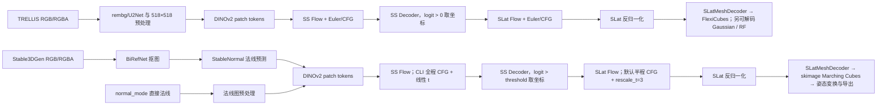

# TRELLIS-new 与 Stable3DGen 推理代码对比分析报告

## 1. 结论摘要

Stable3DGen 保留了 TRELLIS-new 的两阶段 3D 生成主干：`DINOv2 条件编码 → Sparse Structure Flow → occupancy 解码/坐标提取 → SLat Flow → SLat 反归一化 → Mesh Decoder 网络`。在当前 normal checkpoint 配置下，两者的 SS Flow、SS Decoder、SLat Flow 和 `SLatMeshDecoder` 神经网络结构相同；但神经网络输出之后的等值面提取不同：TRELLIS 使用 FlexiCubes，Stable3DGen 改为基于 scikit-image 的 Marching Cubes。这会直接改变最终 Mesh 的顶点、面片和拓扑。

Stable3DGen 的主要改进不在网络主干，而在推理输入和工程控制层：

1. 普通 RGB 图像先变换为表面法线图，再以法线图作为两个 Flow 的条件；也支持直接输入法线图。
2. 背景移除由 rembg/U2Net 改成 BiRefNet，并增加空前景回退、裁剪边界限制、方形透明填充和可选分辨率。
3. 只保留 Mesh 输出，并把 TRELLIS 的 FlexiCubes 提取替换为 Marching Cubes；不再加载或输出 Gaussian、Radiance Field，也没有 text-to-3D 链路。
4. 支持分别替换 SS Flow 和 SLat Flow checkpoint，并增加批量、训练集抽样和 SS 消融推理入口。
5. Stable3DGen 的 CLI/Web 把 SS 阶段改为全程 CFG、线性时间步；SLat 阶段仍继承 pipeline.json 的半程 CFG 和非线性时间重标定。这是数值轨迹上最重要的采样差异。

当前两个仓库中的 `trellis-normal-v0-1` 四个 `.safetensors`、四个模型 `.json` 以及 `pipeline.json` 已用 `cmp`/SHA-256 核对，内容完全一致。因此，不传自定义 checkpoint 时，结果差异应归因于输入条件、预处理、采样参数、FlexiCubes/Marching Cubes 提取算法和导出流程，不能归因于默认 normal 权重。

## 2. 对比范围与方法

本报告检查了推理入口、Pipeline、Flow Euler/CFG sampler、模型加载与兼容层、输出和后处理，并对 normal 配置和权重做了逐字节一致性检查。这是静态代码审计，没有运行 GPU 全量推理。使用标准库 `unittest` 发现并运行 Stable3DGen 测试：23 项通过，`test_cli_rotation` 因当前 Python 环境缺少 `trimesh` 而在导入阶段失败；环境也未安装 `pytest`。

## 3. 两条实际推理链

## 4. 相同点

### 4.1 核心生成算法相同

两者都在 `run()` 中提取条件特征、固定 PyTorch 随机种子，然后依次执行 `sample_sparse_structure()`、`sample_slat()` 和 `decode_slat()`。TRELLIS 实现在 [trellis_image_to_3d.py](/root/autodl-tmp/TRELLIS-new/trellis/pipelines/trellis_image_to_3d.py:257)，Stable3DGen 实现在 [hi3dgen.py](/root/autodl-tmp/Stable3DGen/hi3dgen/pipelines/hi3dgen.py:418)。

共同细节包括：

- 条件编码器均为 `dinov2_vitl14_reg`，读取 `x_prenorm` 后再做 `layer_norm`，负条件为零张量。
- DINO 编码前均缩放到 518×518，并使用同一 ImageNet mean/std。
- SS 阶段均从 `[B,C,R,R,R]` 高斯噪声出发，经 Flow Euler 得到 occupancy latent。
- 正常 SS 阈值均为 `decoder(z_s) > 0`，再用 `argwhere` 生成 `[batch,x,y,z]` 坐标。
- SLat 阶段均在这些坐标上创建稀疏高斯噪声，Flow 采样后按同一 mean/std 反归一化。
- 单图、多图的 seed 位置和 stochastic/multidiffusion 注入逻辑基本一致。

### 4.2 Sampler 数学主体相同

两者都使用 `FlowEulerGuidanceIntervalSampler`，Euler 更新式、`sigma_min`、CFG mixin、guidance interval 与 `rescale_t` 公式相同。Stable3DGen 只是把 sampler 返回值由 `EasyDict` 改成普通 `dict`，pipeline 相应从 `.samples` 改为 `["samples"]`；这不改变数值结果。

### 4.3 当前 normal 模型文件相同

| 组件 | 模型 |
|---|---|
| SS Decoder | `ss_dec_conv3d_16l8_fp16` |
| SS Flow | `ss_flow_normal_dit_L_16l8_fp16` |
| Mesh Decoder | `slat_dec_mesh_swin8_B_64l8m256c_fp16` |
| SLat Flow | `slat_flow_normal_dit_L_64l8p2_fp16` |

Stable3DGen 配置见 [pipeline.json](/root/autodl-tmp/Stable3DGen/weights/trellis-normal-v0-1/pipeline.json:4)，TRELLIS-new 对应配置见 [pipeline.json](/root/autodl-tmp/TRELLIS-new/microsoft/trellis-normal-v0-1/pipeline.json:4)。配置、模型 JSON 和权重逐字节一致。需要注意：相同的 Mesh Decoder 权重只保证网络产生相同布局的 SDF/deform/weights/color 特征，不保证后续不同提取器生成相同 Mesh。

## 5. 差异详解

### 5.1 条件域：RGB 条件改为法线条件

TRELLIS image-large 直接把处理后的 RGB 前景图送入 DINOv2；默认权重名为 `*_img_*`，并配置 Mesh、Gaussian 和 RF decoder，见 [image-large pipeline.json](/root/autodl-tmp/TRELLIS-new/microsoft/TRELLIS-image-large/pipeline.json:4)。

Stable3DGen 加载 `*_normal_*` 的 SS/SLat Flow：普通图像先经 StableNormal 预测法线图，`normal_mode=True` 时直接将输入视作法线图，再送入同一 DINOv2 编码器，见 [cli.py](/root/autodl-tmp/Stable3DGen/cli.py:142)。它不是增加法线特征分支，而是用法线图替换原 RGB 条件图。网络接口不变，条件数据分布改变。

### 5.2 前景预处理：rembg/U2Net 与 BiRefNet

TRELLIS 对无有效 alpha 的输入调用 rembg `u2net`，取 alpha > 0.8 的边界框、外扩 20%、裁剪并缩放到 518×518，最后返回 alpha 预乘 RGB。mask 为空时 `min/max` 会报错，裁剪框可越出原图。代码见 [trellis_image_to_3d.py](/root/autodl-tmp/TRELLIS-new/trellis/pipelines/trellis_image_to_3d.py:85)。

Stable3DGen 延迟加载本地 BiRefNet，在 1024×1024 上预测 mask 并以 128 二值化；mask 为空时回退 RGB，边界框限制在图像内，裁剪后显式透明填充为正方形，且支持指定输出分辨率。代码见 [hi3dgen.py](/root/autodl-tmp/Stable3DGen/hi3dgen/pipelines/hi3dgen.py:137)。它对空 mask 和越界更稳健，但硬阈值与填充也会改变物体尺度、边缘和背景像素。

### 5.3 法线桥接与 normal_mode

Stable3DGen CLI 有两条支路：

- `normal_mode=False`：BiRefNet/裁剪 → StableNormal → Hi3DGen pipeline。
- `normal_mode=True`：跳过 StableNormal，但仍调用 Hi3DGen 的 BiRefNet/裁剪预处理。

因此“直接法线模式”并非原样输入；法线图若无有效 alpha，仍可能被 BiRefNet 重新分割和裁剪。批量与消融脚本均走此路径。

### 5.4 模型加载与 checkpoint 替换

TRELLIS loader 按 pipeline.json 加载，失败时用裸 `except` 尝试独立 Hugging Face 路径，见 [base.py](/root/autodl-tmp/TRELLIS-new/trellis/pipelines/base.py:39)。

Stable3DGen 增加 `slat_flow_model_path` 和 `ss_flow_model_path`，只替换两个 Flow、保持 decoder 不变，支持绝对路径、`weights/` 路径、pipeline 内 checkpoint 名和 Hugging Face 路径，见 [base.py](/root/autodl-tmp/Stable3DGen/hi3dgen/pipelines/base.py:79)。它还对本地文件缺失给出详细错误，并把 checkpoint 中的 `ElasticSLatFlowModel` 别名映射到 `SLatFlowModel`，见 [models/__init__.py](/root/autodl-tmp/Stable3DGen/hi3dgen/models/__init__.py:46)。

### 5.5 采样日程：Stable3DGen 只改了 SS 阶段

两个 normal pipeline.json 默认均为：25 steps、CFG 5、`cfg_interval=[0.5,1.0]`、`rescale_t=3.0`。TRELLIS CLI 只覆盖 steps 和 CFG，两个阶段继续继承 interval 与 rescale。

Stable3DGen 的 `generate_3d()` 对 SS 额外强制 `cfg_interval=(0.0,1.0)`、`rescale_t=1.0`，见 [cli.py](/root/autodl-tmp/Stable3DGen/cli.py:153)。所以 SS 全积分区间执行 CFG，并使用线性 `t: 1→0`；SLat 没有覆盖这两个参数，仍为半程 CFG 与 `rescale_t=3`。即使输入、seed、steps、CFG 和权重相同，只要 SS interval/rescale 不同，稀疏坐标和 Mesh 就不会完全一致。

### 5.6 当前工程默认参数

| 项目 | TRELLIS-new CLI YAML | Stable3DGen CLI YAML |
|---|---:|---:|
| 输入 | 图片目录；多图自动作为多视图 | 单张图片；可切 normal mode |
| SS steps | 20 | 50 |
| SS CFG | 30 | 5 |
| SLat steps | 20 | 6 |
| SLat CFG | 5 | 5 |
| 多图 | stochastic / multidiffusion | pipeline 保留，主 CLI 未暴露 |
| checkpoint 替换 | 主 CLI 未提供 | SS Flow、SLat Flow 可独立替换 |

参数来源见 [TRELLIS default.yaml](/root/autodl-tmp/TRELLIS-new/configs/default.yaml:12) 与 [Stable3DGen default.yaml](/root/autodl-tmp/Stable3DGen/configs/default.yaml:17)。这是仓库工程默认，不是 pipeline.json 模型默认。

### 5.7 Mesh Decoder 网络相同，等值面提取算法不同

两边的 `SLatMeshDecoder` 前向网络相同：相同的 sparse transformer、两次 `SparseSubdivideBlock3d`、`SparseLinear` 输出层和特征布局；Stable3DGen 仅删除了训练用的 `ElasticSLatMeshDecoder` 子类。代码分别见 [TRELLIS decoder_mesh.py](/root/autodl-tmp/TRELLIS-new/trellis/models/structured_latent_vae/decoder_mesh.py:72) 与 [Stable3DGen decoder_mesh.py](/root/autodl-tmp/Stable3DGen/hi3dgen/models/structured_latent_vae/decoder_mesh.py:99)。

网络输出进入 `SparseFeatures2Mesh` 后出现实质差异：

- TRELLIS 使用 FlexiCubes。它同时消费 SDF、deform，以及网络预测的 21 个 FlexiCubes 权重：12 维 `beta`、8 维 `alpha`、1 维 `gamma_f`。这些权重参与交点/QEF 位置和四边形三角化方向的决策，见 [TRELLIS cube2mesh.py](/root/autodl-tmp/TRELLIS-new/trellis/representations/mesh/cube2mesh.py:97) 与 [flexicubes.py](/root/autodl-tmp/TRELLIS-new/trellis/representations/mesh/flexicubes/flexicubes.py:56)。
- Stable3DGen 使用 `skimage.measure.marching_cubes(level=0)`。它依据 SDF 生成标准 Marching Cubes 表面，再用三线性插值取得形变后的绝对顶点位置和颜色，最后翻转每个三角面的索引顺序，见 [Stable3DGen cube2mesh.py](/root/autodl-tmp/Stable3DGen/hi3dgen/representations/mesh/cube2mesh.py:192)。
- Stable3DGen 仍让神经网络输出 21 维 `weights`，但推理提取阶段完全不使用这些值；它们只在 `training=True` 的正则项中被引用。因此，同一 decoder checkpoint 中为 FlexiCubes 学到的 topology/triangulation 控制信号被丢弃。
- TRELLIS FlexiCubes 是 PyTorch/CUDA 路径，并能在无表面时返回空 Mesh；Stable3DGen 把完整 SDF 搬到 CPU/NumPy 调用 scikit-image，存在 CPU 同步与拷贝开销，而且无零交叉时 `marching_cubes` 会抛异常。
- Stable3DGen 的 NumPy 路径不可微，且代码未在 `.numpy()` 前显式 `detach()`；它适用于当前 `torch.no_grad()` 推理，但不能视为与原 FlexiCubes 等价的可训练替换。

因此，即使给两边完全相同的 SLat、相同 Mesh Decoder 权重，最终 Mesh 也通常不会一致。Stable3DGen 的拓扑更接近标准 Marching Cubes；TRELLIS 则会利用 learned FlexiCubes 权重调整表面顶点和三角化。

### 5.8 输出格式与姿态后处理

TRELLIS image-large 可解码 Mesh、3D Gaussian 和 RF；CLI 可渲染 Gaussian 彩色视频与 Mesh normal 视频，烘焙纹理化 GLB，导出 Gaussian PLY 和纯 Mesh PLY，并保留多图和 text-to-3D pipeline。

Stable3DGen 只解码 Mesh，使用 `to_trimesh(transform_pose=True)` 后导出 GLB/OBJ/PLY/STL。CLI 导出前额外绕 X 轴正向旋转 90°，见 [cli.py](/root/autodl-tmp/Stable3DGen/cli.py:186)；Web `app.py` 没有旋转，所以 Web 与 CLI/批处理的坐标朝向不一致。它还可保存 raw/visualized normal map，实验脚本会留存输入副本与 JSON 元数据。

### 5.9 新增实验入口

- `batch_cli.py`：读取 FaceScape metadata，每对象确定性随机选一张条件法线图并批量导出。
- `infer_1_neutral.py`：扫描 neutral 法线目录，支持跳过已有结果和保存法线图。
- `run_ss_ablation_1_neutral.py`：比较 SS 权重、CFG 与 occupancy threshold，并记录坐标数和 bbox。
- `run_ss_trainset_inference.py`：从训练 metadata 筛 neutral 样本，固定抽样并执行 checkpoint 推理。

这些主要增强可复现性和 checkpoint 诊断能力，不改变默认主干网络。

## 6. 兼容性与潜在问题

### 6.1 `num_samples > 1` 风险

TRELLIS sampler 在条件 batch 为 1、噪声 batch 大于 1 时会 repeat 条件，见 [flow_euler.py](/root/autodl-tmp/TRELLIS-new/trellis/pipelines/samplers/flow_euler.py:38)。Stable3DGen 删除了 repeat，见 [flow_euler.py](/root/autodl-tmp/Stable3DGen/hi3dgen/pipelines/samplers/flow_euler.py:61)。当前入口均使用 `num_samples=1`，正常路径不受影响；直接调用 `run(..., num_samples>1)` 时可能发生 batch 不匹配或依赖隐式广播。

### 6.2 通用 pipeline factory 不兼容当前配置名

Stable3DGen 的 `hi3dgen.pipelines.from_pretrained()` 执行 `globals()[config['name']]`，但本地 pipeline.json 的 name 仍为 `TrellisImageTo3DPipeline`，模块只导出 `Hi3DGenPipeline`，见 [pipelines/__init__.py](/root/autodl-tmp/Stable3DGen/hi3dgen/pipelines/__init__.py:28)。app/CLI 直接调用具体类，因此未触发；使用包级 factory 会 `KeyError`。

### 6.3 SLatFlowModel 泛化范围缩窄

TRELLIS 支持 `io_block_channels=None`；Stable3DGen 直接对其求 `len()` 并索引，要求必须为列表，见 [structured_latent_flow.py](/root/autodl-tmp/Stable3DGen/hi3dgen/models/structured_latent_flow.py:156)。当前 normal 配置为 `[128]`，计算兼容，但不能无修改加载省略该字段的其他 TRELLIS SLat 配置。

### 6.4 其他 API/复现风险

- Stable3DGen `run_multi_image()` 默认 formats 仍含 `radiance_field`，而 `decode_slat()` 只处理 Mesh，该键会被静默忽略。
- Web 不旋转 Mesh，CLI/批量入口做 X+90°；做定量或可视化对照前必须统一坐标系。
- 两边都只调用 `torch.manual_seed`，没有强制 CUDA deterministic。Stable3DGen 还固定 `SPCONV_ALGO=native`；跨 GPU/CUDA/spconv 版本不保证逐位一致。

## 7. 公平 A/B 对比建议

1. **Pipeline 等价基线**：两边都用相同 normal 权重、同一预处理法线图、相同 seed/steps/CFG/interval/rescale，只输出 Mesh，用于验证移植等价性。
2. **条件域增益**：固定权重和 sampler，只比较 RGB 条件与 StableNormal 法线条件。
3. **采样/微调增益**：固定同一法线条件，依次比较 SS 全程 CFG/线性 t、不同 SS/SLat checkpoint 和 occupancy threshold。

建议同时记录裁剪图、法线图、SS 坐标数与 bbox、顶点/面数、Chamfer/F-score/normal consistency、单阶段耗时和峰值显存。Stable3DGen 消融脚本已有部分 SS 诊断记录，可作为统一评估入口基础。

## 8. 最终判断

Stable3DGen 是“TRELLIS 两阶段 Flow 生成器的 normal-conditioned、Mesh-only 工程化分支”。它没有改变当前 normal Flow 与 `SLatMeshDecoder` 神经网络拓扑，但实质改变了网络之后的 Mesh 等值面提取算法；同时通过 BiRefNet、StableNormal 条件桥、可替换 Flow checkpoint、SS 采样日程覆盖和批量/消融工具，改变了模型接收的信息和推理轨迹。

结果差异应按以下优先级解释：

1. RGB 与法线条件的分布差异；
2. SS 的 CFG interval 与 `rescale_t`；
3. rembg 与 BiRefNet 的 mask/裁剪；
4. FlexiCubes 与 Marching Cubes 的等值面提取差异；
5. 是否使用自定义微调 SS/SLat Flow；
6. 输出 decoder、Mesh 姿态与后处理。

默认 normal checkpoint 本身不是差异来源。
